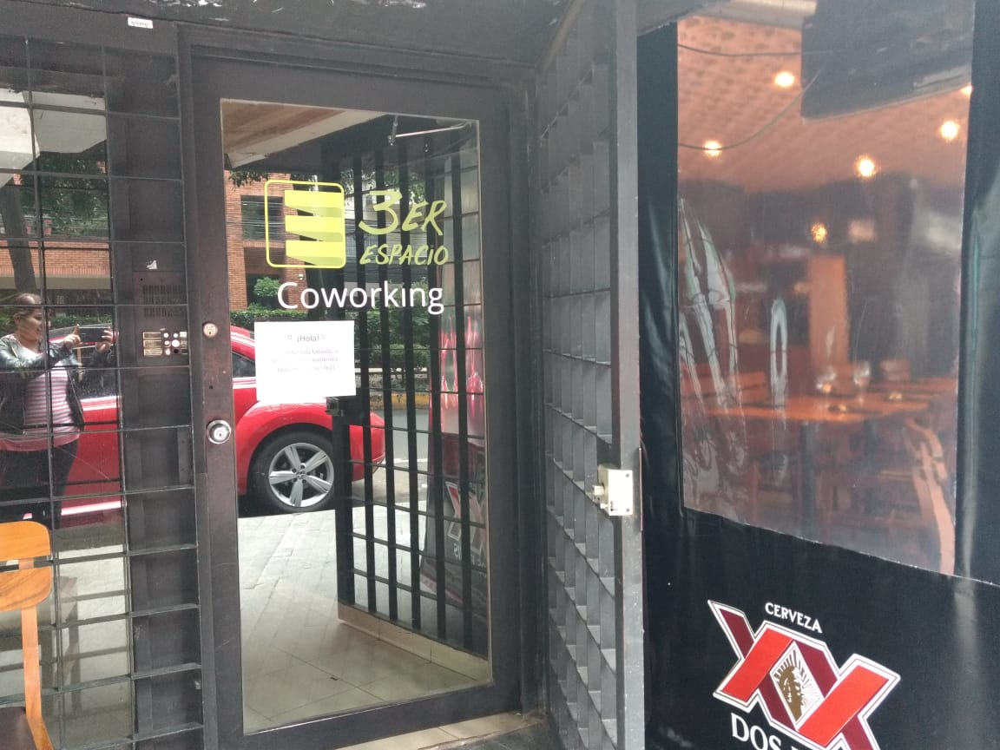
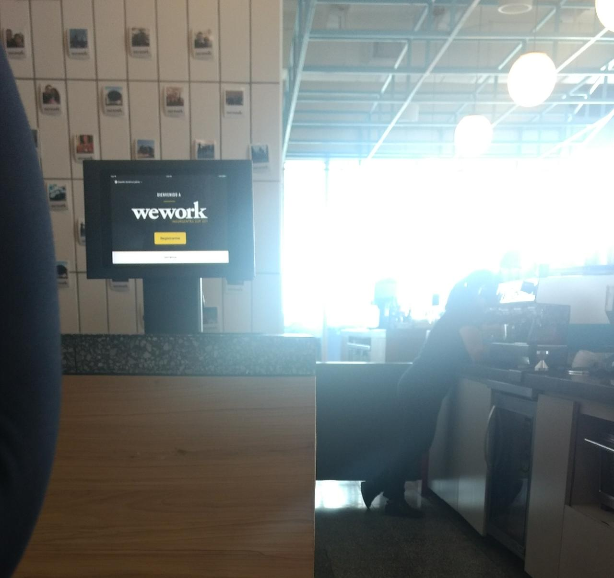

# Registrodevisitantes proceso de UX

##1.-Descubrimiento e investigación

###Definición:

Los espacios de coworking son oficinas compartidas (a veces hasta más de 50 empresas)  en las que profesionales autónomos, trabajadores y empresarios se dan cita para trabajar, y donde los gestores del espacio intentan conectar y crear oportunidades profesionales y personales entre y para sus miembros. En su mayoría se trata de profesionales que no necesitan más que un portátil, un teléfono y una buena conexión a internet para poder realizar su trabajo: programadores, diseñadores, gestores de comunidades online, periodistas, comerciales, consultores, etc.

Es común que a diario se reciban visitas ya sea por negocios, entrevistas de trabajo o para solicitar información. En cada uno de estos coworking se lleva un registro de cada visitante, la mayoría en una bitácora donde se llenan datos como fecha, nombre, nombre de la persona a quien visita, motivo, etc. aparte de tener que dejar una identificación.  Este  registro se vuelve largo y tedioso, donde se emplea mucho tiempo tanto del visitante como el de la persona que lleva el registro a parte que estos datos quedan solo plasmados en papel y si se quieren consultar datos puntuales se tendría que revisar en todas las bitácoras.

###Usuarixs:

###Necesidades de  usuarixs:

Debido a lo monótono y tardado que es el registro de visitantes, se necesita implementar una interfaz que permita el mismo en pocos pasos, que en automático  al registrar el visitante sus datos se le avise a la persona  que va a visitar, y que estos sean guardados en una base de datos para que, si se desean consultar los mismo se pueda de una manera rápida y práctica. 

###Pain points:

Al realizar entrevistas tanto a visitantes como al personal encargado del registro, concluyeron (en el caso del visitante) que se  demora el realizar el registro, este   le solicita muchos datos que en su parecer son innecesarios y que aparte se le requiere una identificación para que se le permita el acceso (con la cual a veces no cuenta), en el caso del recepcionista es cansado repetir instrucciones a cada visitantes y en el caso de los días concurridos  esto interfiere en sus labores.

###Sentimientos:

En ambos casos creen que es un trámite largo y cansado y obstaculiza sus labores.

###Técnicas usadas en esta fase: 

Se realizó una investigación de campo donde se visitó dos coworking y dos WeWork para conocer su proceso de registro y detectar áreas de oportunidad.

•	El primer Coworking que se visito fue 3ER ESPACIO ubicado en Ámsterdan 240, 4to piso, México     CDMX. Se define como una comunidad de emprendedores  pertenecientes a una nueva generación,      es un lugar para desafiar expectativa. Se realizó una entrevista a la gerente de                 comunicaciones algunas de sus labores son el llevar registro de los usuarios que asisten, el     control de los espascios en uso de las salas de juntas, dar acceso a los miembros del            coworking las redes de comunicaciones del Coworkin, entre otros y accedió a explicarnos el       fin de llevar  un registro en este espacio. Quien cuenta con membresía no es necesario que       se registre, solo en el caso de miembros que contratan el espacio por 80 horas (En este caso     para llevar el control de horas ocupadas) o visitantes. El sistema de registro se lleva por      medio de una bitácora de papel (Piensan en implementar una nueva tecnología con  el uso de       tarjetas de acceso para llevar el registro digital de horas que ocupan el espacio). Los          datos que toman en cuenta para llevar su registro son : 
    1.-Nombre
    2.-Fecha
    3.-Hora de entrada
    4.-Hora de salidaç
    5.-Empresa a la que perteneces o nombre de la persona que visitasç

   

    La información recabada la vacían en una hoja de Excel para llevar el control de  visitas, miembros, tiempo de estancia, pagos, entre otros. El tener un registro digital ayudaría a poder simplificar esta tarea, además de poder consultar esta base de datos en cualquier momento y no tener que revisar lista por lista, además de que la administradora podría utilizar este tiempo ahorrado en realizar sus múltiples tareas, y para los visitantes seria mas agil y simple el acceso sobre todo los que van frecuentemente y que continuamente tienen que realizar este engorroso registro en la bitácora. 
    
•	El segundo coworking que se visito fue el de la empresa  WeWork ubicado en Insurgentes 601       cuenta con 8 pisos de espacios de coworking. En este caso se realizó la visita para probar de “cliente incognito”. Al llegar al  edificio se tuvo que pasar un primer registro en bitácora en el caso de visitas y en una libreta en caso de trabajar en el lugar este lo llevaba a cabo gente de seguridad del edificio, para dar que nos dieran acceso al edificio       nos solicitaron  una identificación. Te indican el piso donde se encuentra la recepción del WeWork donde te tienes que registrar nuevamente (solo si algún miembro ha informado a la recepción que te permitan el acceder al lugar) en este caso de manera digital en una Tablet.Como no contábamos con ninguna invitación de algún miembro solo se pudo obtener la información por medio de la recepcionista sobre el modo de registro de visitantes.

### Historias de usuario

1.- Yo como visitante no quiero esperar mucho tiempo para poder ingresar al edificio.
2.- Yo como visitante quiero registrarme al ingresar al edificio de una forma ágil y eficaz.
3.- Yo como visitante no quiero tardar mucho tiempo en registrar mis datos para ingresar al edificio.
4.-Yo como visitante necesito la forma de facilitar mi registro con la finalidad de poder agilizar el ingresar.
5.- Yo como usuario quiero que el registro de datos ocupe el menor tiempo para la agilización del proceso.
6.- Yo como usuario quiero que la interfaz sea lo más simple e intuitiva. 
7.- Yo como usuario quiero ingresa la menor cantidad de datos posibles.
8.- Yo como usuario quiero que a la persona que voy a visita sepa que he llegado. 
###Objetivos del negocio

###Motivaciones del negocio

##2.-Síntestis y definición
### Datos importantes para tener en cuenta
###Insights
##3.-Ideación
##4.-Prototipado
###Sketch

###Prototipo
https://marvelapp.com/33ga6bh/screen/46625206	
##5.-User testing

